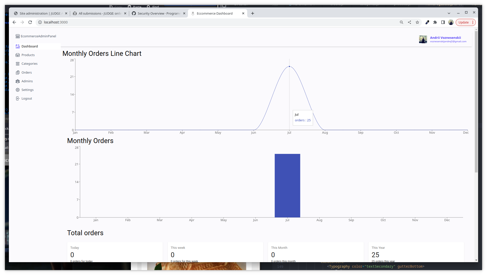

# ecommercex_nextjs_app

ecommercex_nextjs_app is a robust e-commerce solution designed with the latest web technologies, focusing on delivering a seamless user experience both for consumers and administrators.

## 🖼️  Images 
# Frontend client-side


Some images will also go here ...




### Installation & Setup

1. Clone the repository:
   ```bash
   git clone https://github.com/SaintAngeLs/ecommercex_app.git
   cd ecommercex_app
   ```
2. Install the dependencies
    ```bash
        npm install
        # or
        yarn install
        # or
        pnpm install
    ```
3. Runing
 - To start the frontend:
    ```bash 
     cd ecommercex_app
     npm run dev   
    ```
 - To start the admin-frontend:
    ```bash 
     cd ecommerce_admin
     npm run dev   
    ```

# ecommercex_nextjs_app Technologies and Packages

The following lists detail the technologies, libraries, and packages used in the development of the `ecommercex_nextjs_app` and its frontend.

## Core Technologies

- **Next.js**: A React framework that enables features like server-side rendering and generating static websites for React-based web applications.
- **Node.js**: A runtime that lets you execute JavaScript server-side.
- **MongoDB**: A NoSQL database that uses JSON-like documents with optional schemas.
- **Material-UI**: A popular React UI framework.

## Backend (`ecommerce`) Packages

- **AWS SDK for JavaScript**: For interacting with Amazon Web Services.
- **Material-UI**: Core components and icons.
- **MongoDB and Mongoose**: For database management.
- **NextAuth**: Authentication for Next.js applications.
- **D3**: A library for producing dynamic, interactive data visualizations.
- **Axios**: A promise-based HTTP client.
- **Jest**: A JavaScript testing framework.


## Frontend (`ecommercefront`) Packages

- **Apollo Client**: State management library for React that integrates with GraphQL.
- **FontAwesome**: Provides scalable vector icons that can be customized with CSS.
- **Stripe**: Online payment processing for internet businesses.
- **Framer Motion**: A library to create animations and interactions in React.
- **GraphQL**: A query language for your API.
- **NextReveal**: Allows reveal animations with SSR compatibility for Next.js.
- **Nodemailer**: Send emails easily.
- **Styled Components**: Visual primitives for the component age.


Note: For detailed version information and additional packages, refer to the respective `package.json` files.
